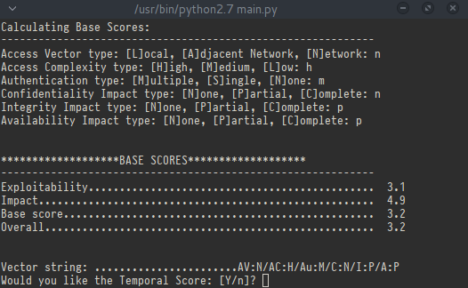

cvss-v2-calc
============
cvss-v2-calc is a Common Vulnerability Scoring System
calculator (for version 2) for the command line.

It provides a minimalistic and interactive way to determine
the scores of the Base Metrics, Temporal Metrics and
Environmental Metrics.

About
-----
* Author:	Evan Ng
* License:	GNU General Public License Version 3

Dependencies
------------
* Python (build and tested with Python 2.7.9)

Running
-------
Simply use it from the cloned folder via 'python main.py'

Current Direction
-----------------
Working on a setup.py for easy tarballing and rpm packaging
